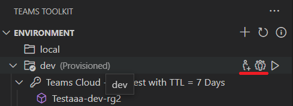

# Zusammenarbeit an Teams Projekt mit Teams Toolkit

Mehrere Entwickler können zusammenarbeiten, um dasselbe TeamsFx-Projekt zu debuggen, bereitzustellen und bereitzustellen. Es ist jedoch erforderlich, manuell die richtigen Berechtigungen für Teams App und AAD App festzulegen, was nicht einfach ist.

Teams Toolkit unterstützt jetzt die Zusammenarbeitsfunktion, damit ein Entwickler (Projektbesitzer) andere Entwickler (Mitarbeiter) zum TeamsFx-Projekt einladen kann, dasselbe TeamsFx-Projekt zu debuggen, bereitzustellen und bereitzustellen.

## Voraussetzungen

* Kontovoraussetzungen

    Um Cloudressourcen in Azure und Microsoft 365 bereitzustellen, benötigen Sie die folgenden Konten mit den richtigen Berechtigungen. Weitere Informationen finden Sie unter [Vorbereiten von Konten zum Erstellen Teams App.](accounts.md)

    * Microsoft 365
    * Azure mit gültigem Abonnement

* [Installieren Sie Teams Toolkit](https://marketplace.visualstudio.com/items?itemName=TeamsDevApp.ms-teams-vscode-extension) Version v3.0.0+.

> [!TIP]
> Sie sollten bereits ein Teams App-Projekt in VS-Code geöffnet haben.

## Zusammenarbeit mit anderen Entwicklern

### Als Projektbesitzer

> [!NOTE]
> Bevor Mitarbeiter für eine Umgebung hinzugefügt werden, muss der Projektbesitzer das Projekt zuerst [bereitstellen.](provision.md)

* Bewegen Sie im Abschnitt **"UMGEBUNG"** auf Teams Toolkit den Mauszeiger auf den Namen der Umgebung, um **Schaltflächen** für Mitarbeiter zu finden. Eine ist die Schaltfläche **"M365 Teams App hinzufügen "Besitzer" (mit AAD App),** die andere schaltfläche **"M365 Teams App (mit AAD App)-Besitzern",** wie in der folgenden Abbildung dargestellt:

  

* Wählen Sie die Schaltfläche "Besitzer von **M365 Teams App hinzufügen" (mit AAD App)** aus, und fügen Sie eine weitere E-Mail-Adresse des M365-Kontos als Mitarbeiter hinzu. Das hinzuzufügende Konto **muss sich auf demselben Mandanten wie der Projektbesitzer für Remotedebugger** befinden, wie in der Abbildung dargestellt:

  

* Um Mitarbeiter in der aktuellen Umgebung anzuzeigen, wählen Sie die Schaltfläche **"M365-Teams-App auflisten (mit AAD App)-Besitzern",** und die Mitarbeiter werden dann im Ausgabekanal aufgeführt, wie in der folgenden Abbildung dargestellt:

  

* Schieben Sie das Projekt an GitHub.

> [!NOTE]
> Der neu hinzugefügte Mitarbeiter erhält keine Benachrichtigung. Project Besitzer muss den Mitarbeiter benachrichtigen.

### Als Projektmitarbeiter

* Klonen des Projekts aus GitHub
* M365-Konto anmelden

> [!NOTE]
> Mitarbeiter sollten sich mit dem Konto anmelden, das vom Projektbesitzer hinzugefügt wurde und **sich unter demselben Mandanten mit dem Projektbesitzer befindet.**

* Melden Sie sich mit dem Azure-Konto an, das über die Berechtigung "Mitwirkender" für alle Azure-Ressourcen verfügt, die in diesem Projekt verwendet werden.
* Wenn Sie an Projektcode arbeiten, stellen Sie das Projekt dann remote bereit, wenn Sie der Meinung sind, dass es an der Zeit ist, eine Vorschau Ihrer Teams-App anzuzeigen.
* Starten Sie die Remote-App, um eine Vorschau der Teams-App zu erhalten. Weitere Informationen finden Sie unter [Erstellen und Ausführen Ihrer Teams-App in einer Remoteumgebung.](/microsoftteams/platform/sbs-gs-javascript?tabs=vscode%2Cvsc%2Cviscode%2Cvcode&tutorial-step=3&branch)

### Einschränkungen

> [!NOTE]
> Azure-bezogene Berechtigungen sollten manuell vom Azure-Abonnementadministrator im Azure-Portal festgelegt werden. Das Azure-Konto sollte mindestens über eine Mitwirkenderolle für das Abonnement verfügen, damit Entwickler zusammenarbeiten können, um das TeamsFx-Projekt bereitzustellen und bereitzustellen.

1. **Kann nicht gelöscht werden:** Mitarbeiter können nicht direkt aus Teams Toolkit-Erweiterung entfernt werden. Führen Sie die folgenden Schritte aus, um Mitarbeiter manuell zu entfernen:

      1. Wechseln Sie zu [Teams Entwicklerportal,](https://  dev.teams.microsoft.com/apps)suchen Sie Ihre Teams App nach Name oder App-ID.
      2. Wählen Sie auf der Teams App-Verwaltungsseite im linken Bereich **"Besitzer"** aus.
      3. Suchen und entfernen Sie den Mitarbeiter.
      4. Wechseln Sie zu [Azure Active Directory,](https://ms.portal.azure.com/#blade/Microsoft_AAD_IAM/ActiveDirectoryMenuBlade/RegisteredApps)wählen Sie **die App-Registrierung** im linken Bereich aus, und suchen Sie Ihre AAD-App.
      5. Wählen Sie auf der AAD App-Verwaltungsseite im linken Bereich **"Besitzer"** aus.
      6. Suchen und entfernen Sie den Mitarbeiter.

1. Mitarbeiter, die Ihrem Projekt hinzugefügt wurden, erhalten keine Benachrichtigung. Project Besitzer muss Mitarbeiter offline benachrichtigen.

## Siehe auch

> [!div class="nextstepaction"]
> [Bereitstellen von Cloudressourcen](provision.md)

> [!div class="nextstepaction"]
> [Bereitstellen Teams App in der Cloud](deploy.md)

> [!div class="nextstepaction"]
> [Verwalten mehrerer Umgebungen](TeamsFx-multi-env.md)
