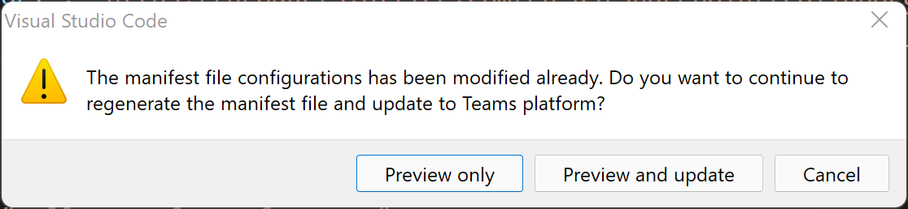

# <a name="preview-teams-app-manifest-in-teams-toolkit"></a>Anzeigen einer Vorschau Teams App-Manifests in Teams Toolkit

Nach dem Erstellen des Gerüsts erhalten Sie zwei Manifestvorlagendateien unter `templates/appPackage` dem Ordner.

- `manifest.local.template.json` – lokale Debug-Teams-App.
- `manifest.remote.template.json` – freigegeben zwischen allen Remoteumgebungen.

Diese Vorlagendateien mit einigen Platzhaltern und die tatsächlichen Werte aus Teams Toolkit werden in Dateien unter `.fx/configs` und `.fx/states` aufgelöst.

## <a name="prerequisite"></a>Voraussetzungen

* [Installieren Sie Teams Toolkit](https://marketplace.visualstudio.com/items?itemName=TeamsDevApp.ms-teams-vscode-extension) Version v3.0.0+.

> [!TIP]
> Sie sollten bereits ein Teams App-Projekt in VS-Code geöffnet haben.

## <a name="preview-manifest"></a>Vorschaumanifest

Um eine Vorschau des Manifests mit echtem Inhalt anzuzeigen, generiert Teams Toolkit Vorschaumanifestdateien unter `build/appPackage` dem Ordner:

```text
└───build
    └───appPackage
        ├───appPackage.{env}.zip - Zipped app package of remote teams app
        ├───appPackage.local.zip - Zipped app package of local team app
        ├───manifest.{env}.json  - Previewed manifest of remote teams app
        └───manifest.local.json  - Previewed manifest of local teams app
```

### <a name="local-debug-teams-app"></a>Lokale Debug-Teams-App

Um eine Vorschau der Manifestdatei der lokalen Teams-App anzuzeigen, müssen Sie **F5** drücken, um zuerst das lokale Debuggen auszuführen. Dieser Schritt generiert lokale Standardeinstellungen für Sie, dann werden das App-Paket und das Vorschaumanifest unter dem Ordner **"build/appPackage"** erstellt.

Die anderen Möglichkeiten sind:

- Wählen Sie **"Vorschau"** in der Codelens der Datei **"manifest.local.template.json"** aus.
- Wählen Sie die **Vorschaumanifestdatei** in der Menüleiste der Datei **"manifest.local.template.json"** aus.
- Wählen Sie **zip Teams Metadatenpaket** in der Strukturansicht und wählen Sie **Lokal** Die Lokale Vorschau wird angezeigt, wie in der folgenden Abbildung dargestellt:


### <a name="remote-environment"></a>Remoteumgebung

Um eine Vorschau der Manifestdatei der Remote-Teams-App anzuzeigen, müssen Sie im Bereich "Entwicklung" in Teams Toolkit-Erweiterungsstrukturansicht die Option **"Bereitstellen in** der Cloud" auswählen oder **Teams auslösen: Zuerst in der Cloud** über die Befehlspalette bereitstellen. Dieser Schritt generiert Konfigurationen für die Remote-Teams-App, dann werden das App-Paket und das Vorschaumanifest unter dem Ordner **"build/appPackage"** erstellt.

Die anderen Möglichkeiten sind:

- Wählen Sie in der Codelens der Datei **"manifest.remote.template.json" die** Option **"Vorschau"** aus.
- Wählen Sie in der Menüleiste der Datei **"manifest.remote.template.json" die** Option **"Vorschaumanifestdatei"** aus.
- Wählen Sie **zip Teams Metadatenpaket** in der Strukturansicht aus, und wählen Sie Ihre Umgebung aus.


> Wenn mehrere Umgebungen vorhanden sind, müssen Sie den Env auswählen, den Sie in der Vorschau anzeigen möchten, wie in der Abbildung dargestellt:


## <a name="sync-local-changes-to-dev-portal"></a>Synchronisieren lokaler Änderungen mit dev Portal

Nach der Vorschau der Manifestdatei können Sie Ihre lokalen Änderungen auf folgende Weise mit Dev Portal synchronisieren:

- Wählen Sie in der oberen linken Ecke von **Aktualisieren auf Teams Plattform** aus.`manifest.{env}.json`
- Select **Teams: Update manifest to Teams platform** at the menu bar of`manifest.{env}.json`
- Auslösen Teams: Aktualisieren des **Manifests auf Teams Plattform** über die Befehlspalette


 

> [!NOTE]
> Trigger from editor codelens or title button will update current manifest file to Teams platform. Für trigger from command palette will requireing target environment.

Wenn die Manifestdatei aufgrund einer Konfigurationsdateiänderung oder einer Vorlagenänderung veraltet ist, wird der Benutzer aufgefordert, seine Aktion zu bestätigen: 

- **Nur Vorschau:** Lokale Manifestdatei wird gemäß der aktuellen Konfiguration überschrieben
- **Vorschau und Aktualisierung:** Die lokale Manifestdatei wird gemäß der aktuellen Konfiguration überschrieben und gleichzeitig auf Teams Plattform aktualisiert.
- **Abbrechen:** Nichts tun

> [!NOTE]
> Die Änderungen werden auf das Entwicklungsportal aktualisiert. Wenn Sie über einige manuelle Updates im Dev Portal verfügen, wird es überschrieben.

## <a name="see-also"></a>Siehe auch

> [!div class="nextstepaction"]
> [Anpassen Teams App-Manifests in Teams Toolkit](TeamsFx-manifest-customization.md)
