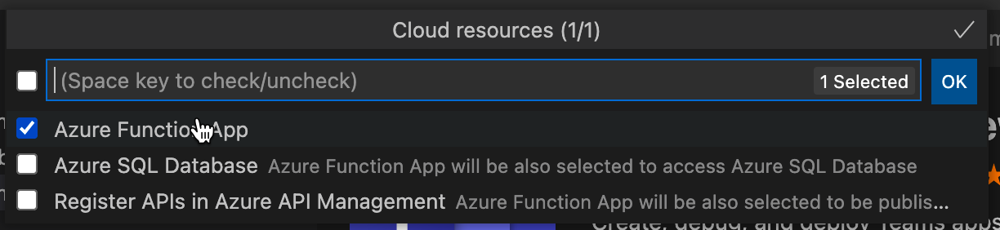

# Hinzufügen von Cloudressourcen zu Ihrer Teams-App

TeamsFx hilft bei der Bereitstellung von Cloudressourcen für Ihr Anwendungshosting. Sie können optional auch Cloudressourcen hinzufügen, die Ihren Entwicklungsanforderungen entsprechen.

## Voraussetzungen

* [Installieren Sie Teams Toolkit](https://marketplace.visualstudio.com/items?itemName=TeamsDevApp.ms-teams-vscode-extension) Version v3.0.0+.

> [!TIP]
> Sie sollten bereits über ein Teams App-Projekt verfügen.

## Hinzufügen von Cloudressourcen mit Teams Toolkit

> [!IMPORTANT]
> Sie müssen jede Umgebung bereitstellen, nachdem Sie eine Ressource hinzugefügt haben.

1. Öffnen **Sie Visual Studio Code**.
1. Wählen Sie im linken Bereich **Teams Toolkit** aus:

    

1. Wählen Sie im Bereich Teams Toolkit-Seitenleiste die Option **"Cloudressourcen hinzufügen"** aus:

    

    Sie können auch die Befehlspalette öffnen und **Teams: Hinzufügen von Cloudressourcen** eingeben:
    
    > [!NOTE]
    > Führen Sie denselben Prozess aus, wie er in der Strukturansicht ausgelöst wird:

    

1. Wählen Sie im Popup alle Cloudressourcen aus, die Sie Ihrem Teams-App-Projekt hinzufügen möchten:

     

1. Wählen Sie **OK** aus.

## Hinzufügen von Cloudressourcen mithilfe von TeamsFx CLI im Befehlsfenster

1. Ändern Sie das Verzeichnis in Das **Projektverzeichnis.**
1. Führen Sie den Befehl aus, um verschiedene Funktionen hinzuzufügen.

In der folgenden Tabelle werden Cloudressourcen und die entsprechenden Befehle zum Hinzufügen beschrieben:

|Cloudressourcen|Befehl|
|---------------|----------|
| Azure-Funktion|`teamsfx resource add azure-function --function-name your-func-name`|
| Azure SQL-Datenbank|`teamsfx resource add --function-name your-func-name`|
| Azure-API-Verwaltung|`teamsfx resource add azure-apim`|

## Welche Cloudressourcen hinzugefügt werden können

TeamsFx bietet nahtlose Integrationen in Azure-Dienste, die für die folgenden Anwendungsszenarien üblich sind:

- [Azure-Funktionen:](/azure/azure-functions/functions-overview)Eine serverlose Lösung, die Ihre Anforderungen bei Bedarf erfüllt, z. B. das Erstellen von Web-APIs für Ihre Teams-Anwendungs-Back-End.
- [Azure SQL-Datenbank:](/azure/azure-sql/database/sql-database-paas-overview)Ein vollständig verwaltetes PaaS-Datenbankmodul (Platform as a Service), das als Datenspeicher für Ihre Teams Anwendungen dient.
- [Azure-API-Verwaltung:](/azure/azure-sql/database/sql-database-paas-overview)Ein API-Gateway, das verwendet werden kann, um APIs zu verwalten, die für Teams Anwendungen erstellt wurden, und diese für andere Anwendungen zu veröffentlichen, z. B. Power Apps.

## Was geschieht, wenn Sie Ressourcen hinzufügen

Die folgenden Änderungen werden an Ihrem Projekt vorgenommen, wenn Sie Ressourcen hinzufügen:

- Azure.parameter können neue Parameter hinzugefügt werden. {env}.json zum Bereitstellen der erforderlichen Informationen für die Bereitstellung.
- Neue Inhalte werden an die ARM-Vorlage unter Ordner angefügt (mit Ausnahme von `templates/azure` Dateien unter `templates/azure/teamsfx` Ordner), um die hinzugefügten Azure-Ressourcen zu erstellen.
- Dateien im Ordner werden neu generiert, um sicherzustellen, dass die erforderliche Konfiguration von `templates/azure/teamsfx` TeamsFx für hinzugefügte Azure-Ressourcen auf dem neuesten Stand ist.
- `.fx/projectSettings.json` aktualisiert wird, um die in Ihrem Projekt vorhandenen Ressourcen nachzuverfolgen.

In der Zwischenzeit gibt es einige zusätzliche Änderungen für jede Art von Ressource:

|Hinzugefügte Ressourcen|Änderungen|Warum diese Änderungen vorgenommen werden|
|---------------|---------------|-----------------------------|
|Azure Functions|Ein Azure Functions-Vorlagencode wird einem Unterordner mit Pfad hinzugefügt. `yourProjectFolder/api`  `launch.json` und `task.json` unter `.vscode` Ordner aktualisiert.| Fügen Sie eine HTTP-Triggervorlage "Hello World" in Ihr Projekt ein.   Um die erforderlichen Skripts für Visual Studio Code einzuschließen, die ausgeführt werden, wenn Sie Ihre Anwendung lokal debuggen möchten.|
|Azure-API-Verwaltung|Eine Open API Specification-Datei, die einem Unterordner mit Pfad hinzugefügt wurde `yourProjectFolder/openapi`|Dies ist die API-Spezifikationsdatei, die Ihre API nach der Veröffentlichung definiert.|

## Einschränkungen

- Sie können Ihrem Projekt nur eine Funktions-App/Azure SQL-Datenbank/APIM-Dienst hinzufügen.
- Sie können keine Ressourcen hinzufügen, wenn Ihr Projekt keine Registerkarten-App enthält.

## Siehe auch

> [!div class="nextstepaction"]
> [Bereitstellen von Cloudressourcen](provision.md)
