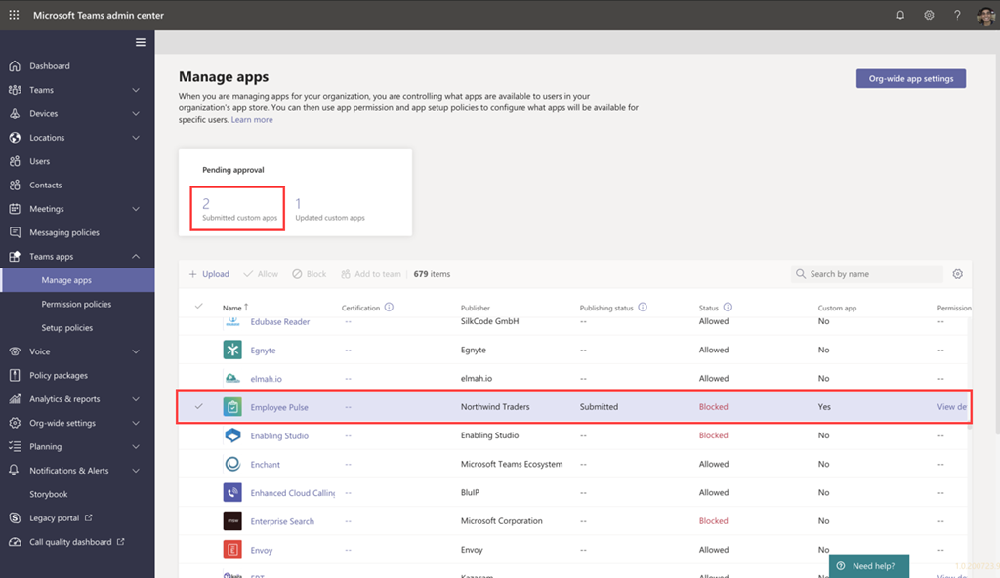

# Veröffentlichen Teams Apps mit Teams Toolkit

Nach dem Erstellen der App können Sie Ihre App auf einen anderen Bereich verteilen, z. B. einzeln, team, organisation oder jeder. Die Verteilung hängt von mehreren Faktoren ab, einschließlich Anforderungen, geschäftlichen und technischen Anforderungen und Ihrem Ziel für die App. Die Verteilung auf einen anderen Bereich erfordert möglicherweise einen anderen Überprüfungsprozess. Im Allgemeinen gilt: Je größer der Bereich, desto mehr Überprüfungen muss die App aus Sicherheits- und Compliancegründen durchlaufen.

## Voraussetzungen

* [Installieren Sie Teams Toolkit](https://marketplace.visualstudio.com/items?itemName=TeamsDevApp.ms-teams-vscode-extension) Version v3.0.0+.

> [!TIP]
> Sie sollten bereits über ein Teams App-Projekt verfügen.

## Veröffentlichen im einzelnen Bereich (Querladen-Berechtigung)

Benutzer können Teams benutzerdefinierte Apps hinzufügen, indem sie ein App-Paket in einer .zip-Datei direkt in ein Team oder in einen persönlichen Kontext hochladen. Durch das Hinzufügen einer benutzerdefinierten App durch Hochladen eines App-Pakets, das auch als Querladen bezeichnet wird, können Sie die App testen, während sie entwickelt wird, bevor sie wie in den folgenden Szenarien erwähnt umfassend verteilt werden kann:

* Testen und debuggen Sie eine App lokal selbst oder mit anderen Entwicklern.
* Erstellen Sie eine App nur für sich selbst. Beispielsweise zum Automatisieren eines Workflows.
* Sie haben eine App für eine kleine Gruppe von Benutzern erstellt, z. B. Für Ihre Arbeitsgruppe.

Außerdem können Sie eine App nur für die interne Verwendung erstellen und für Ihr Team freigeben, ohne sie an den Teams App-Katalog im Teams App Store zu übermitteln.

* Erstellen Ihrer App in *.zip App-Paketdatei

    Sie können das App-Paket erstellen, indem Sie `Zip Teams metadata package` im BEREITSTELLUNGsbereich in der Strukturansicht von Teams Toolkit auswählen. Möglicherweise müssen Sie `Provision in the cloud` zuerst ausführen. Das generierte App-Paket befindet sich `{your project folder}/build/appPackage/appPackage.{env}.zip` wie in der folgenden Abbildung dargestellt:

 

## In Ihrer Organisation veröffentlichen 

Wenn die App für die Verwendung in der Produktion bereit ist, kann der Entwickler die App mithilfe der Teams App-Übermittlungs-API übermitteln, die von Graph API aufgerufen wird, einer integrierten Entwicklungsumgebung (Integrated Development Environment, IDE), z. B. Visual Studio Code mit Teams Toolkit installiert. Sie können entweder im BEREITSTELLUNGsbereich in der Strukturansicht von Teams Toolkit **"Veröffentlichen in Teams"** auswählen oder **Teams auslösen: Veröffentlichen in Teams** über die Befehlspalette. Wählen Sie dann wie in der folgenden Abbildung dargestellt die Option **"Für Ihre Organisation installieren"** aus:

Dadurch wird die App auf der Seite "Apps verwalten" im Microsoft Teams Admin Center verfügbar, auf der Sie und der Administrator sie überprüfen und genehmigen können.

Als Administrator können Sie auf der Seite "Apps verwalten" im [Microsoft Teams Admin Center](https://admin.teams.microsoft.com/policies/manage-apps) alle Teams Apps für Ihre Organisation anzeigen und verwalten. Hier können Sie den Status und die Eigenschaften von Apps auf Organisationsebene anzeigen, neue benutzerdefinierte Apps im App Store Ihrer Organisation genehmigen oder hochladen, Apps auf Organisationsebene blockieren oder zulassen, Apps zu Teams hinzufügen, Dienste für Drittanbieter-Apps kaufen, von Apps angeforderte Berechtigungen anzeigen, Apps Administratorzustimmung erteilen und organisationsweite App-Einstellungen verwalten.

Verwalten sie die [Seite "Apps" im Admin Center](https://admin.teams.microsoft.com/policies/manage-apps) Teams Toolkit für Visual Studio Code, die auf der Teams App-Übermittlungs-API aufbauen, und ermöglicht es Ihnen, den Übermittlungs- und Genehmigungsprozess für benutzerdefinierte Apps auf Teams zu automatisieren.

> [!NOTE]
> Beachten Sie, dass die App dadurch noch nicht im App Store Ihrer Organisation veröffentlicht wird. In diesem Schritt wird die App an das Microsoft Teams Admin Center übermittelt, wo Sie sie für die Veröffentlichung im App Store Ihrer Organisation genehmigen können.

## Administratorgenehmigung für übermittelte Teams-Apps

Der Administrator Ihres Teams Mandanten kann dann zur Seite "Apps verwalten" im Microsoft Teams Admin Center wechseln (wechseln Sie in der linken Navigationsleiste zu Teams Apps > Apps verwalten), bietet Ihnen eine Ansicht aller Teams Apps für Ihre Organisation. Das Widget "Genehmigung ausstehend" oben auf der Seite informiert Sie darüber, wann eine benutzerdefinierte App zur Genehmigung übermittelt wird.
In der Tabelle zeigt eine neu übermittelte App automatisch den Veröffentlichungsstatus "Übermittelt" und den Status "Blockiert" an. Sie können die Spalte "Veröffentlichungsstatus" in absteigender Reihenfolge sortieren, um die App schnell zu finden:

 

Wählen Sie den App-Namen aus, um zur Seite "App-Details" zu wechseln. Auf der Registerkarte "Info" können Sie Details zur App anzeigen, einschließlich Beschreibung, Status, Absender und App-ID:

 

Wenn Sie bereit sind, die App für Benutzer verfügbar zu machen, führen Sie die Schritte zum Veröffentlichen der App aus:

1. Wechseln Sie in der linken Navigationsleiste des Microsoft Teams Admin Centers zu Teams Apps > Verwalten von Apps.
2. Wählen Sie den App-Namen aus, um zur Seite "App-Details" zu wechseln, und wählen Sie dann im Veröffentlichungsstatusfeld "Veröffentlichen" aus.
Nachdem Sie die App veröffentlicht haben, ändert sich der Veröffentlichungsstatus in "Veröffentlicht", und der Status wird automatisch in "Zulässig" geändert.

## Veröffentlichen in Microsoft Store

Sie können Ihre App direkt an den Store innerhalb Microsoft Teams verteilen und Millionen von Benutzern auf der ganzen Welt erreichen. Wenn Ihre App auch im Store enthalten ist, können Sie potenzielle Kunden sofort erreichen.
Apps, die im Teams Store veröffentlicht wurden, werden ebenfalls automatisch in Microsoft AppSource aufgeführt, dem offiziellen Marketplace für Microsoft 365 Apps und Lösungen.
Verstehen Sie den Veröffentlichungsprozess, wenn Sie den Eindruck haben, dass Ihre App produktionsbereit ist, können Sie damit beginnen, sie im Teams Store zu veröffentlichen.

>[!Tip]
> Wenn Sie die Schritte vor der Übermittlung genau befolgen, kann dies die Möglichkeit erhöhen, dass Microsoft Ihre App für die Veröffentlichung genehmigt.

* Überprüfen Sie die Teams Store-Validierungsrichtlinien, um sicherzustellen, dass Ihre App Teams App- und Store-Standards erfüllt.
* Erstellen Sie ein Partner Center-Entwicklerkonto.
* Bereiten Sie Ihre Store-Übermittlung vor. Dazu gehören das Ausführen automatisierter Tests, das Kompilieren von Testnotizen, das Erstellen eines Store-Eintrags sowie andere wichtige Aufgaben, um den Überprüfungsprozess zu beschleunigen.
* Übermitteln Sie Ihre App über Partner Center.
* Arbeiten Sie direkt mit Microsoft, um die Probleme zu beheben und Ihre App erneut zu übermitteln (Link, um die Probleme zu beheben und Ihre App erneut zu übermitteln).

## Siehe auch

> [!div class="nextstepaction"]
> [Verwalten mehrerer Umgebungen](TeamsFx-multi-env.md)

> [!div class="nextstepaction"]
> [Zusammenarbeit mit anderen Entwicklern an Teams Projekt](TeamsFx-collaboration.md)