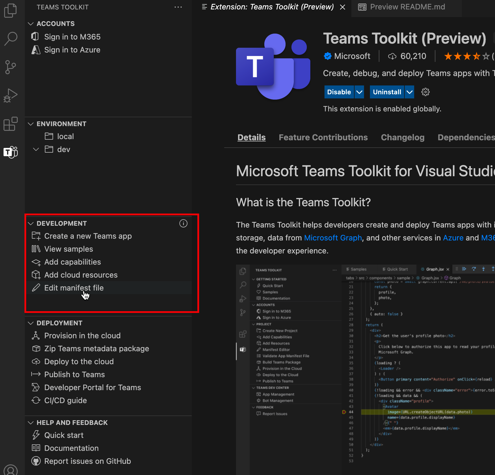

# Teams Toolkit

> [!NOTE]
> Derzeit ist dieses Feature nur in der **öffentlichen Entwicklervorschau** verfügbar.

Teams Toolkit für Visual Studio Code hilft Entwicklern, Teams Apps mit integrierter Identität, Zugriff auf Cloudspeicher, Daten von Microsoft Graph und anderen Diensten in Azure und Microsoft 365 mit einem Nullkonfigurationsansatz für die Entwicklerumgebung zu erstellen und bereitzustellen.  

Es gibt ein Teams Toolkit für Visual Studio und ein [CLI-Tool](https://github.com/OfficeDev/TeamsFx/blob/dev/docs/cli/user-manual.md) für Teams App-Entwicklung (genannt `teamsfx` ).

## Installieren des Teams Toolkits für Visual Studio Code

1. Öffnen **Sie Visual Studio Code.**

1. Wählen Sie die Erweiterungsansicht (**STRG+UMSCHALT+X**  /  **⌘⇧-X** oder **Ansicht > Erweiterungen) aus.**

1. Geben Sie in das Suchfeld **Teams Toolkit** ein.

1. Wählen Sie neben dem Teams Toolkit die Schaltfläche **"Installieren"** aus.

Sie finden das Teams Toolkit auch im [Visual Studio Code Marketplace.](https://marketplace.visualstudio.com/items?itemName=TeamsDevApp.ms-teams-vscode-extension)

## Unterstützen Teams-App-Funktionen

[Microsoft Teams App-Funktionen](../concepts/capabilities-overview.md) sind Teams Erweiterbarkeitspunkte.Teams Das Toolkit für Visual Studio Code unterstützt Entwickler bei der Arbeit an Projekten mit den folgenden Teams App-Funktionen:

* [Registerkarten](../tabs/what-are-tabs.md#microsoft-teams-tabs)

* [Bots](../bots/what-are-bots.md#bots-in-microsoft-teams)

* [Messaging-Erweiterungen](../messaging-extensions/what-are-messaging-extensions.md#messaging-extensions) 

Ihr Teams Projekt kann entweder eine der Funktionen oder alle drei Funktionen von oben enthalten. Sie können eine beliebige Funktion auswählen, wenn Sie die Teams Project erstellen.

Teams Toolkit bietet Flexibilität, um weitere Funktionen im weiteren Prozess der Teams App-Entwicklung hinzuzufügen.

## User Journey of Teams Toolkit

Teams Toolkit bietet Features Teams App-Entwicklung, um das Debuggen, Bereitstellen und Veröffentlichen zu vereinfachen. Teams Toolkit automatisiert die manuelle Arbeit und bietet eine hervorragende Integration von Teams und Azure-Ressourcen. Die folgende Abbildung zeigt Teams Toolkit-User Journey:

## Machen Sie eine Tour durch Teams Toolkit für Visual Studio Code

Wenn Sie kein Teams Projekt in VS Code öffnen oder ein Projekt öffnen, das nicht mit Teams Toolkit v2.+ erstellt wurde, wird die Teams Toolkit-Benutzeroberfläche mit eingeschränkten Funktionen angezeigt, wie in der folgenden Abbildung dargestellt:

:::image type="content" source="./images/teams-toolkit-beforestart.png" alt-text="Vor dem Start Teams Toolkit":::

Sie können **"Schnellstart"** auswählen, um das Teams Toolkit zu erkunden, oder wählen **Sie "Neue Teams-App** erstellen" aus, um ein Teams Projekt zu erstellen. Wenn Sie eine von Teams Toolkit v2.+ erstellte Teams Project in VS Code geöffnet haben, sehen Sie Teams Toolkit-Benutzeroberfläche mit weiteren Funktionen, wie in der folgenden Abbildung dargestellt:

:::image type="content" source="./images/teams-toolkit-overview.png" alt-text="Machen Sie eine Tour zum Teams Toolkit":::

Sehen wir uns die Funktionen an, die in Teams Toolkit verfügbar sind:

* [Accounts](#accounts)

* [Umgebung](#environment)

* [Development](#development)

* [Bereitstellung](#deployment)

* [Hilfe und Feedback](#help-and-feedback)

### Konten

Entwickler müssen über ein Microsoft 365 Konto verfügen, um Teams App zu erstellen. Wenn Sie nicht über ein Entwicklerkonto verfügen, können Sie ein kostenloses Teams Entwicklerkonto erhalten, indem Sie dem [Microsoft 365-Entwicklerprogramm](https://developer.microsoft.com/microsoft-365/dev-program)beitreten:

Azure-Konto wird häufig in Teams App-Entwicklung verwendet. Wenn Sie Ihre Teams-App hosten oder auf Ressourcen in Azure zugreifen möchten, benötigen Sie ein Azure-Konto. Teams Toolkit unterstützt die integrierte Oberfläche für die Anmeldung, Bereitstellung und Bereitstellung von Azure-Ressourcen. Sie können [ein kostenloses Azure-Konto erstellen,](https://azure.microsoft.com/free/) bevor Sie beginnen.

 Weitere Informationen finden Sie unter [Vorbereiten von Konten zum Erstellen Teams App](accounts.md)

### Umgebung

Teams Toolkit hilft Ihnen bei der Verwaltung mehrerer Umgebungen. Sie können Umgebungen hinzufügen, konfigurieren und anpassen. Sie können für jede Umgebung Mitarbeiter hinzufügen:

 Weitere Informationen finden Sie unter [Verwalten mehrerer Umgebungen](TeamsFx-multi-env.md) und [Zusammenarbeit mit anderen Entwicklern an Teams Projekt.](TeamsFx-collaboration.md)

### Development

Teams Toolkit bietet Ihnen die Möglichkeit, Ihr Teams App-Projekt zu erstellen und anzupassen, sodass die Teams App-Entwicklung einfach und schnell funktioniert: 

1. **Erstellen Sie eine neue Teams-App,** hilft ihnen, Teams App-Entwicklung mit einem Vorlagenprojekt "Hello World" oder einem Beispielprojekt zu beginnen. Weitere Informationen finden Sie unter [Erstellen eines neuen Teams Projekts.](create-new-project.md)
1. **Zeigen Sie Beispiele** an, zeigt eine Reihe von Teams Beispiel-Apps, die Sie erkunden, verweisen und entwickeln können.
1. **Fügen Sie Funktionen hinzu,** um während des Entwicklungsprozesses jederzeit eine weitere Teams Funktionen zu Teams App hinzuzufügen. Weitere Informationen finden Sie unter [Hinzufügen von Funktionen zu Ihrer Teams-App.](add-capability.md)
1. Mit dem **Hinzufügen von Cloudressourcen** können Sie zusätzliche Cloudressourcen entsprechend der Anforderungsänderung hinzufügen. Weitere Informationen finden Sie unter [Hinzufügen von Cloudressourcen für Ihre Teams-App.](add-resource.md)
1. Mit der **Bearbeitungsmanifestdatei** können Sie ganz einfach bearbeiten, wie die Teams-App in Teams Client integriert wird. Weitere Informationen finden Sie unter [Vorschau Teams Manifestdatei](TeamsFx-manifest-preview.md) und [Bearbeiten Teams Manifestdatei.](TeamsFx-manifest-customization.md)

### Bereitstellung)

Während oder nach der Entwicklung sollten Sie den Prozess befolgen, um Teams App bereitzustellen, bereitzustellen und zu veröffentlichen, bevor sie für Ihre Benutzer zugänglich ist:

1. Wenn Sie Ihre Teams-App in Azure hosten möchten oder Azure-Ressourcen verwenden müssen, hilft Ihnen **die Bereitstellung in der Cloud** bei der Automatisierung des Prozesses zum Erstellen von Azure-Ressourcen. Um es verwenden zu können, benötigen Sie ein Azure-Abonnement. Weitere Informationen finden Sie unter [Bereitstellen von Cloudressourcen.](provision.md)

1. Bevor Sie Ihre App veröffentlichen oder freigeben, können Sie Ihre Teams-App in Pakete erstellen, indem Sie **ZIP Teams Metadatenpaket** auswählen.

1. **Deploy to the Cloud** helps you to deploy their source code to Azure. Die Voraussetzung für die Bereitstellung besteht darin, dass bereitgestellte Ressourcen bereitgestellt werden, indem Sie **"Bereitstellung" in der Cloud** ausführen, oder Sie müssen die Azure-Ressourcen manuell erstellen und den Ressourcenparameter in den Einstellungen Ihrer Projektumgebung angeben. Weitere Informationen finden Sie unter [Bereitstellen Teams App in der Cloud.](deploy.md)

1. Anstatt Ihre benutzerdefinierte Teams App manuell zu veröffentlichen, können Sie die Funktion **"Veröffentlichen in Teams"** verwenden, um Teams API aufzurufen, um Teams App zu veröffentlichen. Sie benötigen die Berechtigung zum Hochladen Teams App. Weitere Informationen finden Sie unter [Veröffentlichen Ihrer App in Teams](publish.md).

1. Im Entwicklerportal für Teams können Sie Ihre Teams App verwalten und verteilen. Weitere Informationen finden Sie im [Entwicklerportal.](/microsoftteams/platform/concepts/build-and-test/teams-developer-portal)

1. Teams Toolkit bietet auch CI/CD-Vorlage für CI/CD-Tools wie GitHub Workflow, Azure Devops und Jenops. Weitere Informationen finden Sie unter Erstellen von [CI/CD-Pipelines für Teams Anwendung](use-CICD-template.md)

### Hilfe und Feedback

In diesem Abschnitt finden Sie ganz einfach die dokumentation und ressourcen, die Sie benötigen. Sie können im Teams Toolkit **"Probleme melden" auf GitHub** auswählen, um **schnellen Support** von Produktexperten zu erhalten. Durchsuchen Sie das Problem, bevor Sie ein neues erstellen, oder besuchen Sie das [StackOverflow-Tag, `teams-toolkit` ](https://stackoverflow.com/questions/tagged/teams-toolkit) um zu navigieren und Fragen zu stellen:

## Siehe auch

> [!div class="nextstepaction"]
> [Erstellen eines neuen Projekts mit Teams Toolkit](create-new-project.md)

> [!div class="nextstepaction"]
>[Vorbereiten von Konten zum Erstellen Teams Apps](accounts.md)
