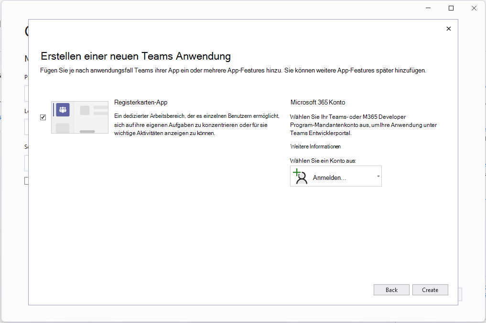

# Microsoft Teams-Toolkit-Erweiterung für Visual Studio

Erstellen, testen und entwickeln Sie für Teams in Ihrer IDE.

Die Erweiterung von Teams Toolkit für Visual Studio macht es einfach, neue Projekte für Teams zu erstellen, Apps automatisch im Teams Developer Portal einzurichten, in Teams auszuführen und zu debuggen, Cloud-Hosting zu konfigurieren und [TeamsFx](https://github.com/OfficeDev/teamsfx) von Ihrer IDE aus zu verwenden.

## Installieren Sie das Teams-Toolkit für Visual Studio

>[!NOTE]
> Stellen Sie als Voraussetzung sicher, dass Sie Visual Studio 2022 17.1 Preview 2 oder neuer verwenden, um die nachstehenden Anweisungen zu befolgen.

1. Wenn Sie Visual Studio 2022 17.1 Preview 2 bereits installiert haben, fahren Sie mit dem nächsten Schritt fort. Andernfalls [Visual Studio 2022 Preview](https://visualstudio.microsoft.com/vs/preview/)installieren.
2. Öffnen Sie den Visual Studio-Installer.
3. Wählen Sie für Ihre vorhandene VS 2022 Preview-Installation **Ändern** aus.
4. Wählen Sie die Workload **ASP.NET und Webentwicklung** aus.
5. Erweitern Sie auf der rechten Seite den Abschnitt **ASP.NET- und Webentwicklung**, und wählen Sie **Microsoft Teams-Entwicklungstools** in der Liste der optionalen Komponenten aus.
6. Wählen Sie im Visual **Studio-Installer Installieren** oder **Ändern** aus, um den Installationsvorgang abzuschließen.

## Beginnen Sie schnell mit einem neuen Projekt

Teams-Toolkit-Projektvorlagen stellen alle Codes, Dateien und Konfigurationen bereit, die Sie benötigen, um mit einem Teams-App-Projekt zu beginnen.

Mit der Microsoft Teams-App-Projektvorlage können Sie ein Microsoft 365-Konto angeben, das für die automatische Registrierung und Konfiguration Ihrer neuen Teams-App erforderlich ist.

> [!NOTE]
> Wenn Sie kein Microsoft 365-Konto haben, können Sie sich für ein Abonnement des [Microsoft 365-Entwicklerprogramms](https://developer.microsoft.com/microsoft-365/dev-program) anmelden. Es ist 90 Tage lang kostenlos und verlängert sich, solange Sie es für Entwicklungsaktivitäten verwenden. Wenn Sie über ein Visual Studio Enterprise- oder Professional-Abonnement verfügen, enthalten beide Programme ein kostenloses Microsoft 365-Entwicklerabonnement, [das für die Dauer Ihres Visual Studio-Abonnements](https://aka.ms/MyVisualStudioBenefits) aktiv ist. Weitere Informationen [finden Sie unter Einrichten eines Microsoft 365-Entwicklerabonnements](/office/developer-program/office-365-developer-program-get-started).

1. Starten Sie Visual Studio 2022.
1. Wählen Sie im **Startfenster Neues Projekt erstellen**.
1. Geben Sie im **Feld Nach Vorlagen** suchen Microsoft Teams App ein.
1. Wählen Sie die **Microsoft Teams-App** Vorlage und dann **Weiter aus**.
1. Geben Sie im **Fenster Neues Projekt** konfigurieren _HelloTeams_ in das Feld **Projektname** ein oder geben Sie es ein. Wählen Sie dann **Erstellen aus**.
1. Wählen Sie im **Fenster Neue Teams-Anwendung** erstellen ein Microsoft 365-Konto aus oder melden Sie sich mit der **Kontoauswahl bei einem Konto** an. Wählen Sie dann **Erstellen aus**.

Visual Studio öffnet Ihr neues Projekt und Teams Toolkit richtet Ihr neues Projekt im Teams Developer Portal ein. Das Projekt wird für die Teams-Organisation hinzugefügt, die mit dem Microsoft 365-Konto verknüpft ist, das Sie in den obigen Schritten ausgewählt haben, und eine neue Azure Active Directory-Registrierung erstellen. Dies ist erforderlich, damit die App in Teams ausgeführt werden kann.

## Führen Sie Ihre App in Teams aus und debuggen Sie sie

Sie können Ihr App-Projekt starten, das lokal von Visual Studio aus ausgeführt wird.

1. Öffnen oder [erstellen Sie ein Teams-App-Projekt](#get-started-quickly-with-a-new-project).
2. Drücken Sie **F5**, oder wählen Sie in Visual Studio **Debuggen > Debuggen** starten aus.

Visual Studio startet Ihr Teams-App-Projekt in einem Browser und beginnt mit dem Debuggen.

## Hosten Sie Ihre Teams-App in der Cloud und zeigen Sie eine Vorschau an

Sie können Cloud-Ressourcen zum Hosten Ihrer App in Azure mit dem Teams-Toolkit erstellen und automatisch konfigurieren.

1. Wählen Sie im Cloud-Menü **Projekt > Teams-Toolkit > Bereitstellung** aus.
2. Wählen Sie im Fenster Wählen Sie Ihr Abonnement aus das Azure-Abonnement aus, mit dem Sie Ressourcen erstellen möchten.

Teams Toolkit erstellt Azure-Ressourcen in diesem Abonnement, aber während dieses Schritts wird kein Code bereitgestellt. So stellen Sie Ihr Projekt für diese neuen Ressourcen bereit:

1. Wählen Sie im Cloud-Menü **Projekt > Teams-Toolkit > Bereitstellen** aus.

## Zeigen Sie eine Vorschau Ihrer App an, die von Cloud-Ressourcen ausgeführt wird

Sie können Ihre App mithilfe der Remoteressourcen in einem Browser ausführen, um zu überprüfen, ob alles funktioniert. Es ist noch nicht möglich, in diesem Szenario zu debuggen.

1. Wählen Sie das Menü **Projekt > Teams-Toolkit > Vorschau der Teams-App** aus.

Ihre App wird in einem Browser geöffnet und verwendet die Ressourcen, die durch die Schritte „Bereitstellen“ und „Bereitstellen“ erstellt wurden.

## Veröffentlichen Ihrer App in Teams

Im Entwicklerportal von [Teams können Sie Ihre App in ein Team hochladen](https://dev.teams.microsoft.com/home), Ihre App für Benutzer in Ihrer Organisation an den benutzerdefinierten App Store Ihres Unternehmens senden oder Ihre App für alle Benutzer von Teams an App Source senden.

- Ihr IT-Administrator wird diese Übermittlungen überprüfen.
- Sie können zur Seite **Veröffentlichen** zurückkehren, um Ihren Übermittlungsstatus zu überprüfen und zu erfahren, ob Ihre App von Ihrem IT-Administrator genehmigt oder abgelehnt wurde. Hier können Sie auch Updates für Ihre App übermitteln oder alle derzeit aktiven Übermittlungen stornieren.
