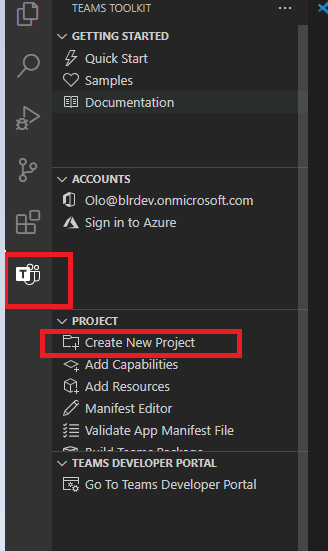
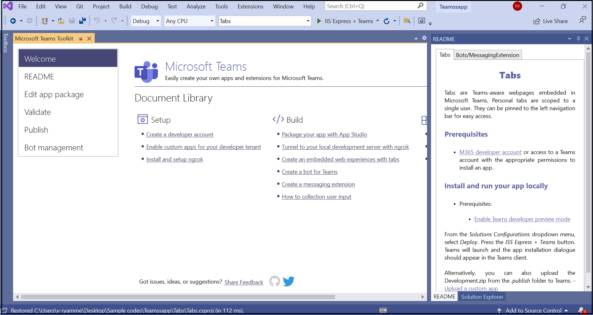

# Erstellen von Apps mit dem Teams-Toolkit und Visual Studio

Mithilfe des Microsoft Teams-Toolkits können Sie benutzerdefinierte Teams-Apps direkt innerhalb der integrierten Entwicklungsumgebung (Integrated Development Environment, IDE) von Visual Studio erstellen. Das Microsoft Teams-Toolkit führt Sie durch den Vorgang und bietet alles, was Sie zum Erstellen, Debuggen und Starten Ihrer Teams-App benötigen.

## Voraussetzungen

1. [Aktivieren Sie die Entwicklervorschau.](../resources/dev-preview/developer-preview-intro.md#enable-developer-preview)

1. Stellen Sie sicher, dass der Visual Studio-Instanz das **ASP.NET- und Webentwicklungsmodul** hinzugefügt wurde. Sie können dies überprüfen, indem Sie die Schritte im Ändern von Visual Studio ausführen, [indem Sie Workloads und Komponentendokumentation hinzufügen oder entfernen.](/visualstudio/install/modify-visual-studio?view=vs-2019&preserve-view=true)

3. Wenn Sie Ihre App testen möchten, indem Sie sie in Visual Studio bereitstellen, müssen Sie Internetinformationsdienste (Internet Information Services, IIS)) in Ihrer Entwicklungsumgebung installiert haben. Visual Studio enthält iis nicht und ist nicht in der Standardkonfiguration für Windows 10, Windows 8 oder Windows 7 enthalten. Sie können jedoch die neueste Version aus dem [Microsoft Download Center](https://www.microsoft.com/download/details.aspx?id=48264)herunterladen.

## Installieren des Teams-Toolkits

Das Microsoft Teams-Toolkit für Visual Studio steht im [Visual Studio Marketplace](https://marketplace.visualstudio.com/items?itemName=TeamsDevApp.vsteamstemplate) oder direkt über das Menü **"Erweiterungen"** in Visual Studio zum Download zur Verfügung. Laden Sie auch das [Teams-Toolkit für Visual Studio 2019](https://marketplace.visualstudio.com/items?itemName=msft-vsteamstoolkit.vsteamstoolkit)aus dem Visual Studio Marketplace herunter.

## Verwenden des Toolkits

- [Einrichten eines neuen Projekts](#set-up-a-new-teams-project)
- [Konfigurieren Sie die App](#configure-your-app)
- [Verpacken Ihrer App](#package-your-app)
- [Installieren und Ausführen Ihrer App in Teams](#install-and-run-your-app-locally)
- [Validieren Ihrer App](#validate-your-app)
- [Veröffentlichen eigener Apps](#publish-your-app-to-teams)

## Einrichten eines neuen Teams-Projekts

1. Klicken Sie auf **Neues Projekt erstellen**.

    

1. Wählen Sie das Schnellstarttool für **die Microsoft Teams-App** aus, und wählen Sie **"Weiter"** aus.
1. Geben Sie auf der Seite **"Neues Projekt konfigurieren"** den **Projektnamen,** **den Speicherort** und den **Projektmappennamen** ein.
1. Aktivieren Sie das Kontrollkästchen **"Projektmappe und Projekt im selben Verzeichnis** platzieren".
1. Wählen Sie im Popupfenster **"Funktionen hinzufügen"** eine oder mehrere Funktionen für das Projektsetup aus.
1. Wählen Sie die Schaltfläche **"Weiter"** aus, um den Konfigurationsprozess abzuschließen.
1. Wählen Sie im Popupfenster **"Funktionen hinzufügen"** die Eigenschaften für jede ausgewählte Funktion aus.
1. Klicken Sie auf **Fertigstellen**. Die Startseite des **Microsoft Teams-Toolkits** wird angezeigt.

    

## Konfigurieren Sie die App

Im Kern umfasst die Teams-App drei Komponenten:

  1. Der Microsoft Teams-Client, einschließlich Web, Desktop oder Mobil, in dem Benutzer mit Ihrer App interagieren.
  1. Ein Server, der auf Anforderungen für Inhalte reagiert, die in Teams angezeigt werden, z. B. HTML-Registerkarteninhalte oder eine adaptive Bot-Karte.
  1. Ein Teams-App-Paket besteht aus drei Dateien:

      - Die manifest.json
      - Ein [Farbsymbol](../resources/schema/manifest-schema.md#icons) für Ihre App, das im öffentlichen App- oder Organisations-App-Katalog angezeigt werden soll.
      - Ein [Gliederungssymbol](../resources/schema/manifest-schema.md#icons) für die Anzeige auf der Teams-Aktivitätsleiste.

Wenn eine App installiert ist, analysiert der Teams-Client die Manifestdatei, um die erforderlichen Informationen wie den Namen Ihrer App und die URL zu ermitteln, unter der sich die Dienste befinden.

> [!NOTE]
>Wenn sie dies noch nicht getan haben, müssen Sie sich bei Ihrem Microsoft 365-Konto anmelden, um den Entwicklungsprozess fortzusetzen.
>
> Wenn Sie kein Microsoft 365-Konto haben, können Sie sich für ein Abonnement des [Microsoft 365-Entwicklerprogramms](https://developer.microsoft.com/microsoft-365/dev-program) registrieren. Es ist 90 Tage kostenlos und wird verlängert, solange Sie es für Entwicklungsaktivitäten verwenden. Wenn Sie über ein Visual Studio Enterprise- oder Professional-Abonnement verfügen, enthalten beide Programme ein kostenloses Microsoft [365-Entwicklerabonnement,](https://aka.ms/MyVisualStudioBenefits)das für die Lebensdauer Ihres Visual Studio-Abonnements aktiv ist. Weitere Informationen finden Sie unter [Einrichten eines Microsoft 365-Entwicklerabonnements.](/office/developer-program/office-365-developer-program-get-started)

### Konfigurationsschritte 

1. Um Ihre App zu konfigurieren, wählen Sie auf der Startseite des **Microsoft Teams-Toolkits** **"App-Paket bearbeiten"** aus.
1. Wählen Sie im Dropdownmenü **"Meine Umgebungen"** die Option **"Entwicklung"** aus.
1. Bearbeiten Sie auf der Seite **"App-Details"** die Eigenschaftenfelder Ihrer App.
    
    Durch das Bearbeiten der Felder auf der Seite "App-Details" wird der Inhalt der manifest.jsauf der Datei aktualisiert, die als Teil des App-Pakets ausgeliefert wird. Weitere Informationen finden Sie im [Teams-Toolkit-Manifest.](https://aka.ms/teams-toolkit-manifest)

## Verpacken Ihrer App

Wenn Sie die **App-Detailseite** ändern oder das **Manifest** oder **ENV-Dateien** im  **Veröffentlichungsordner** Ihrer App aktualisieren, wird automatisch Ihre **Development.zip** Datei generiert. Die Development.zip-Datei enthält drei erforderliche Dateien, die **manifest.jsund** [zwei Symbole.](../concepts/build-and-test/apps-package.md#app-icons)

## Lokales Installieren und Ausführen der App

1. Wählen Sie im Dropdownmenü **"Lösungskonfigurationen"** die Option **"Bereitstellen"** aus, wie in der folgenden Abbildung dargestellt:

    

1. Wählen Sie die Schaltfläche **IIS Express + Teams** aus.

    Das Dialogfeld für die App-Installation wird im Teams-Client angezeigt.

## Validieren Ihrer App

Auf der Seite **"Überprüfen"** können Sie Ihr App-Paket überprüfen, bevor Sie Ihre App an AppSource übermitteln. Laden Sie einfach das Manifestpaket hoch, und das Überprüfungstool überprüft Ihre App anhand aller Testfälle im Zusammenhang mit dem Manifest. Für jeden fehlgeschlagenen Test enthält die Beschreibung einen Link zur Dokumentation, über den Sie den Fehler beheben können. Für die Tests, die schwer zu automatisieren sind, enthält die **vorläufige Prüfliste** 7 der häufigsten fehlgeschlagenen Testfälle sowie einen Link zu einer vollständigen Übermittlungscheckliste.

## Veröffentlichen Ihrer App in Teams

* Auf Ihrer Projekthomepage können Sie Ihre App in ein Team hochladen, Ihre App für Benutzer in Ihrer Organisation an den benutzerdefinierten App Store Ihres Unternehmens senden oder Ihre App für alle Teambenutzer an App Source senden.

* Ihr IT-Administrator wird diese Übermittlungen überprüfen.

* Sie können zur **Veröffentlichungsseite** zurückkehren, um ihren Übermittlungsstatus zu überprüfen und zu erfahren, ob Ihre App von Ihrem IT-Administrator genehmigt oder abgelehnt wurde. Hier können Sie auch Updates für Ihre App übermitteln oder alle derzeit aktiven Übermittlungen abbrechen.

## Nächster Schritt

> [!div class="nextstepaction"]
> [Verwalten und Unterstützen Ihrer veröffentlichten App](../concepts/deploy-and-publish/appsource/post-publish/overview.md)
>
