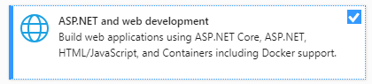

# Erstellen von Apps mit dem Teams Toolkit und Visual Studio

Mithilfe des Microsoft Teams-Toolkits können Sie benutzerdefinierte Teams-Apps direkt innerhalb der integrierten Entwicklungsumgebung (Integrated Development Environment, IDE) von Visual Studio erstellen. Das Microsoft Teams-Toolkit führt Sie durch den Vorgang und bietet alles, was Sie zum Erstellen, Debuggen und Starten Ihrer Teams-App benötigen.

## Voraussetzungen

1. [Aktivieren der Entwicklervorschau](../resources/dev-preview/developer-preview-intro.md#enable-developer-preview)

1. Stellen Sie sicher, **dass ASP.NET-** und Webentwicklungsmodul zu Ihrer Visual Studio hinzugefügt wurde. Sie können dies überprüfen, indem Sie die Schritte in der Visual Studio ausführen, indem Sie [Arbeitsauslastungen und Komponentendokumentation](/visualstudio/install/modify-visual-studio?view=vs-2019&preserve-view=true) hinzufügen oder entfernen.

3. Wenn Sie Ihre App testen möchten, indem Sie sie von Visual Studio bereitstellen, müssen Sie IIS (Internetinformationsdienste) in Ihrer Entwicklungsumgebung installieren. Visual Studio enthält iiS nicht und ist nicht in der Standardkonfiguration von Windows 10, Windows 8 oder Windows 7 enthalten. Sie können jedoch die neueste Version aus dem [Microsoft Download Center herunterladen.](https://www.microsoft.com/download/details.aspx?id=48264)

## Installieren des Teams Toolkits

Das Microsoft Teams Toolkit für Visual Studio steht zum Download über den Visual Studio  [Marketplace](https://marketplace.visualstudio.com/items?itemName=TeamsDevApp.vsteamstemplate) oder direkt über das Menü "Erweiterungen" in Visual Studio.

## Verwenden des Toolkits

- [Einrichten eines neuen Projekts](#set-up-a-new-teams-project)
- [Konfigurieren Sie die App](#configure-your-app)
- [Packen Ihrer App](#package-your-app)
- [Ausführen Ihrer App in Teams](#install-and-run-your-app-locally)
- [Validieren Ihrer App](#validate-your-app)
- [Veröffentlichen eigener Apps](#publish-your-app-to-teams)

## Einrichten eines neuen Teams-Projekts

1. Wählen **Sie "Neues Projekt erstellen" aus.**
1. Wählen **Sie "Microsoft Teams-App"** und dann **"Weiter" aus.**
1. Sie gelangen zum Bildschirm **"Neues** Projekt konfigurieren", auf dem Sie den **Projektnamen,** den Speicherort **und** den **Projektmappennamen auswählen können.**
1. Aktivieren Sie das Kontrollkästchen **"Projektmappe und Projekt im selben Verzeichnis platzieren".**
1. In einem Popupfenster  mit der Bezeichnung "Funktionen hinzufügen" können Sie eine oder mehrere Funktionen für Ihre Projekteinrichtung auswählen.
1. Klicken Sie auf die **Schaltfläche "Weiter",** um den Konfigurationsprozess zu abschließen.
1. In einem Popupfenster  mit der Bezeichnung "Funktionen hinzufügen" können Sie die Eigenschaften für jede ausgewählte Funktion auswählen.
1. Select **Finish** and you will land on the **Microsoft Teams Toolkit** landing page.

## Konfigurieren Sie die App

Im Kern umfasst die Teams-App drei Komponenten:

  1. Der Microsoft Teams-Client (Web, Desktop oder Mobil), auf dem Benutzer mit Ihrer App interagieren.
  1. Ein Server, der auf Anforderungen für Inhalte reagiert, die in Teams angezeigt werden, z. B. HTML-Registerkarteninhalt oder eine adaptive Botkarte.
  1. Ein [Teams-App-Paket,](/concepts/build-and-test/apps-package.md) das aus drei Dateien besteht:

  > [!div class="checklist"]
  >
  > - Der manifest.jsein
  > - Ein [Farbsymbol](../resources/schema/manifest-schema.md#icons) für Ihre App, das im öffentlichen oder Organisations-App-Katalog angezeigt werden soll
 > - Ein [Gliederungssymbol,](../resources/schema/manifest-schema.md#icons) das auf der Aktivitätsleiste von Teams angezeigt wird.

Wenn eine App installiert ist, analysiert der Teams-Client die Manifestdatei, um die erforderlichen Informationen wie den Namen Ihrer App und die URL zu ermitteln, unter der sich die Dienste befinden.

> [!NOTE]
>Wenn Sie dies noch nicht getan haben, müssen Sie sich bei Ihrem Microsoft 365- oder Konto anmelden, um mit dem Entwicklungsprozess fortzufahren.
>
> Wenn Sie kein Microsoft 365-Konto haben, können Sie sich für ein Abonnement des [Microsoft 365-Entwicklerprogramms](https://developer.microsoft.com/microsoft-365/dev-program) registrieren. Es ist *90* Tage lang kostenlos und wird kontinuierlich verlängert, solange Sie es für Entwicklungsaktivitäten verwenden. Wenn Sie über ein Visual Studio  *Enterprise-* oder Professional-Abonnement verfügen, enthalten beide Programme ein kostenloses Microsoft 365-Entwicklerabonnement, das für die Lebensdauer Ihres Visual Studio ist.  *Weitere Informationen* finden Sie unter Einrichten [eines Microsoft 365-Entwicklerabonnements.](https://docs.microsoft.com/office/developer-program/office-365-developer-program-get-started)
>

### Konfigurationsschritte 

1. Um Ihre App zu konfigurieren, wählen Sie auf der **Startseite des Microsoft Teams Toolkits** **"App-Paket bearbeiten" aus.**
1. Wählen Sie **im** Dropdownmenü "Meine Umgebungen" die **Option "Entwicklung" aus.**
1. Sie gelangen auf die **Seite "App-Details",** auf der Sie die Eigenschaftenfelder Ihrer App bearbeiten können.
1. Durch Bearbeiten der Felder auf der Seite "App-Details" wird der Inhalt der Datei manifest.jsaktualisiert, die letztendlich als Teil des App-Pakets enthalten ist. [Weitere Informationen](https://aka.ms/teams-toolkit-manifest)

## Packen Ihrer App

Durch Ändern der **Seite** mit den **App-Details** oder Aktualisieren des  **Manifests** oder von **ENV-Dateien** im Veröffentlichungsordner Ihrer App wird automatisch dieDevelopment.zipgeneriert. Die Development.zip enthält drei erforderliche Dateien: diemanifest.js **und** [zwei Symbole.](../concepts/build-and-test/apps-package.md#app-icons)

## Lokales Installieren und Ausführen Ihrer App

1. Wählen Sie **im Dropdownmenü "Lösungskonfigurationen"** die Option **"Bereitstellen" aus.**

2. Wählen Sie die **Schaltfläche "IIS Express + Teams"** aus.

1. Teams wird gestartet, und der Dialog zur Installation der App sollte im Teams-Client angezeigt werden.

## Validieren Ihrer App

Auf **der Seite** "Überprüfen" können Sie Ihr App-Paket überprüfen, bevor Sie Ihre App an AppSource übermitteln. Laden Sie einfach das Manifestpaket hoch, und das Validierungstool überprüft Ihre App mit allen Manifest-bezogenen Testfällen. Für jeden fehlgeschlagenen Test enthält die Beschreibung einen Dokumentationslink, der Ihnen bei der Behebung des Fehlers hilft. Für die Tests, die nur  schwer automatisiert werden können, enthält die vorläufige Prüfliste 7 der häufigsten fehlgeschlagenen Testfälle sowie einen Link zu einer vollständigen Übermittlungscheckliste.

## Veröffentlichen Ihrer App in Teams

✔ Auf der Startseite Ihres Projekts können Sie Ihre App in ein Team hochladen, Ihre App an den benutzerdefinierten App Store Ihres Unternehmens für Benutzer in Ihrer Organisation übermitteln oder Ihre App an die App-Quelle für alle Teams-Benutzer übermitteln.

✔ Ihr IT-Administrator überprüft diese Übermittlungen.

✔ Sie können zur Seite  "Veröffentlichen" zurückkehren, um Ihren Übermittlungsstatus zu überprüfen und zu erfahren, ob Ihre App von Ihrem IT-Administrator genehmigt oder abgelehnt wurde. Hier können Sie auch Updates für Ihre App übermitteln oder derzeit aktive Übermittlungen abbrechen.

> [!div class="nextstepaction"]
> [Nächster Schritt: Verwalten und Unterstützen Ihrer veröffentlichten App](../concepts/deploy-and-publish/appsource/post-publish/overview.md)
>
